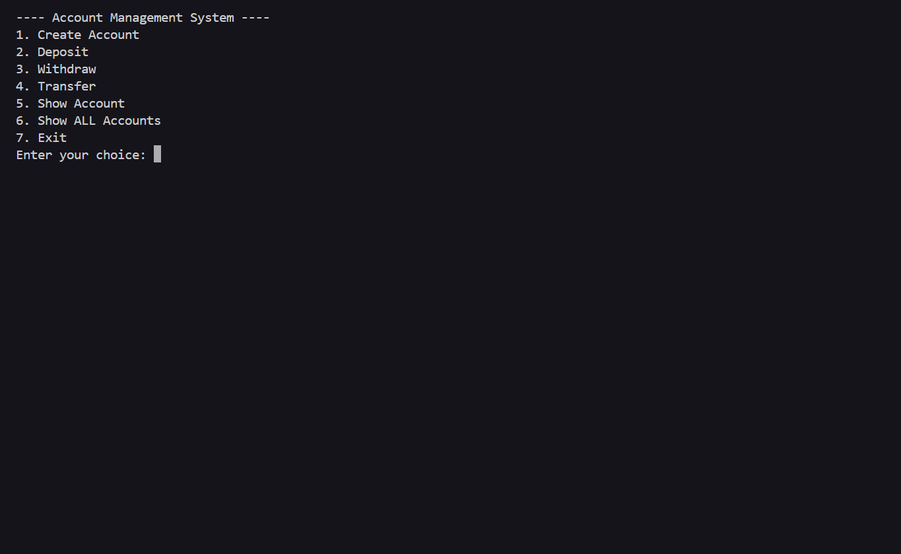

✅ Account Management System

A simple console-based bank account management system written in Java.
Demonstrates OOP concepts (classes, encapsulation), collections, and basic banking operations: create account, deposit, withdraw, transfer, and list accounts.

✨ Features
➕ Create new accounts (account number, holder name, initial balance)
💰 Deposit money to an account, you can use multiple accounts.
➖ Withdraw money from an account (with basic validation) 
🔁 Transfer money between accounts

🔍 Show a single account's details

📋 Show all accounts stored in memory 
 
⚠️ Graceful input handling to avoid crashes (InputMismatchException)

🛠 Tech Stack

🧾 Language: Java

⚙️ Runtime: Java 8+ (Java 11+ recommended)

📦 No external libraries — uses standard Java packages

📁 Project Structure
AccountManagementSystem.java   // contains Account, AccountManager and main class
README.md
output.png                

ℹ️ All classes are bundled in one file for simplicity. You can split them into Account.java, AccountManager.java, and AccountManagementSystem.java later.

▶️ How to compile & run

Open terminal/command prompt in project folder and run:

# compile
javac AccountManagementSystem.java

# run
java AccountManagementSystem

If you split classes into separate files:

javac *.java
java AccountManagementSystem

To create and run a JAR (optional):

# compile
javac *.java

# create jar
jar cfe AccountManagementSystem.jar AccountManagementSystem *.class

# run jar
java -jar AccountManagementSystem.jar

🧾 Usage example (sample session)
---- Account Management System ----
1. Create Account
2. Deposit
3. Withdraw
4. Transfer
5. Show Account
6. Show ALL Accounts
7. Exit
Enter your choice: 1
Enter Account No: A001
Enter Holder Name: Rahul Kumar
Enter Initial Balance: 5000
Account created successfully!

Enter your choice: 2
Enter Account No: A001
Enter Amount to Deposit: 1500
Deposited: 1500.0

Enter your choice: 6
Account No: A001 | Holder: Rahul Kumar | Balance: 6500.0

Exiting... Goodbye!

### 🖼 Example output

✅ Validation & error handling

🛡 Catches InputMismatchException to handle invalid numeric inputs without crashing.

✅ Validates amounts (e.g., deposit > 0, withdraw <= balance).

🗄 Data is stored in memory using a HashMap — all data is lost when the program exits.

🚀 Possible improvements (TODO)

💾 Persist accounts to disk (JSON, CSV, or serialization) so data persists between runs.

🔐 Add account authentication (PIN/password).

📂 Split classes into separate files and add unit tests.

📝 Replace System.out.println with logging.

🖥 Build a GUI (Swing/JavaFX) or a web UI (Spring Boot).

⚖️ Add concurrency control for multi-threaded use.

.gitignore suggestions
*.class
*.jar
*.log
.DS_Store

For full source code, you can mail me.

📝 License

This project can be released under the MIT License. Add a LICENSE file with the full license text if you choose MIT.

👤 Author

Anish Raj

